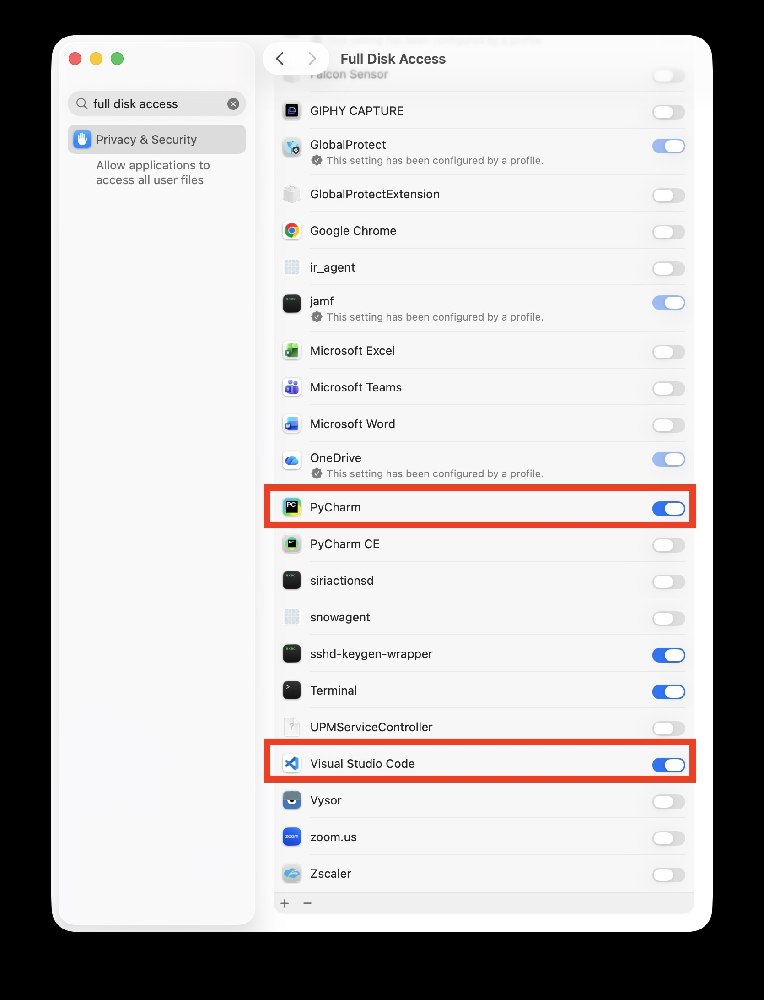
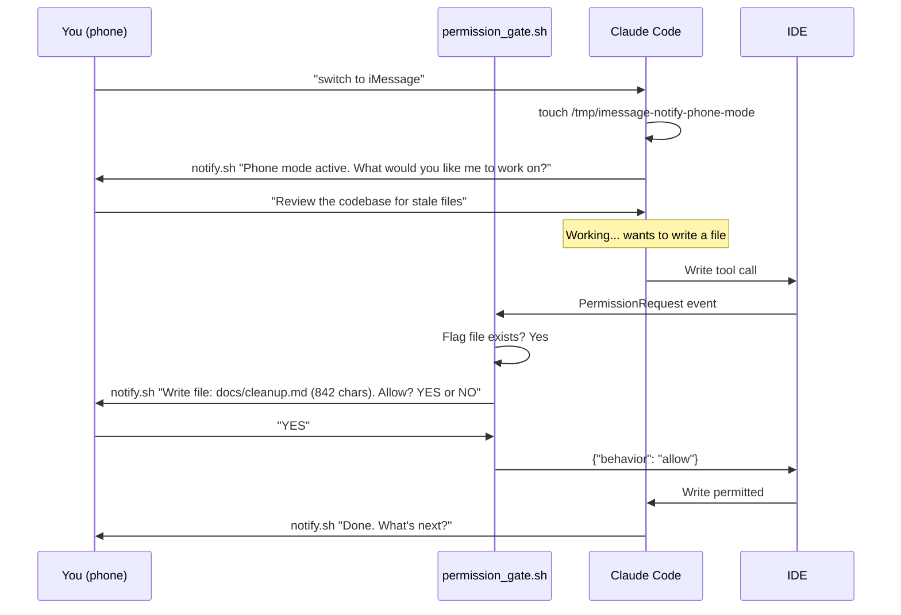
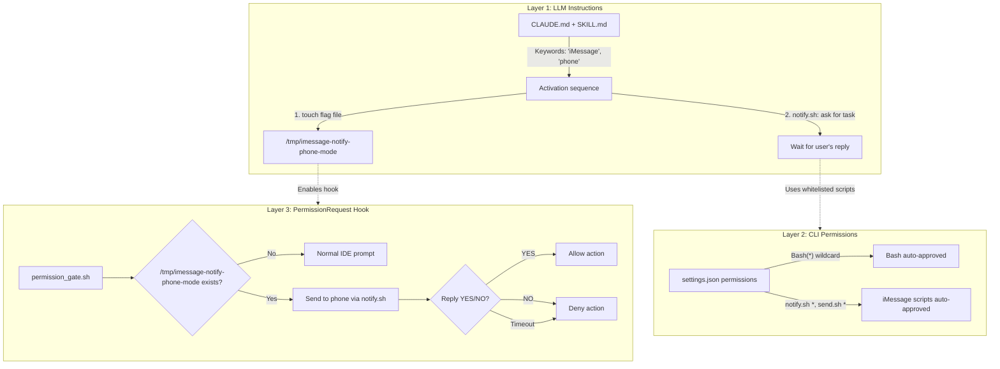
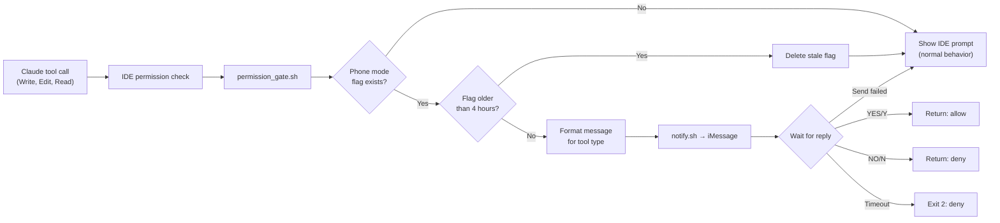

# claude-notifications

iMessage notifications for Claude Code. Send messages to your phone, get approvals via iMessage, and switch between IDE and phone approval modes dynamically.

## Warning - May still need to yell at Claude a few times


## Table of Contents

- [Quick Start](#quick-start)
- [Install](#install)
  - [Git Clone](#git-clone)
  - [Internal Artifactory (pip)](#installation-via-internal-artifactory-pip)
- [Prerequisites](#prerequisites)
- [What It Does](#what-it-does)
- [Usage](#usage)
  - [Send a Status Update](#send-a-status-update-fire-and-forget)
  - [Send and Wait for Reply](#send-and-wait-for-reply)
  - [Multiline Messages](#multiline-messages-file-mode)
  - [Phone Mode in Claude Code](#phone-mode-in-claude-code)
- [Per-Repo Permissions](#per-repo-permissions)
- [Updating](#updating)
- [Uninstall](#uninstall)
- [Multi-Session Support](#multi-session-support)
- [Reply Routing / Aliases](#reply-routing--aliases)
- [Architecture](#architecture)
  - [Layer 1: LLM Instructions](#layer-1-llm-instruction-layer)
  - [Layer 2: CLI Permissions](#layer-2-cli-tool-permission-layer)
  - [Layer 3: PermissionRequest Hook](#layer-3-permissionrequest-hook-layer)
  - [How All Three Layers Work Together](#all-three-layers-must-be-configured)
  - [Remaining Limitations](#remaining-limitations)
- [Troubleshooting](#troubleshooting)
- [Development](#development)
- [Documentation](#documentation)

---

## Quick Start

```
You (in Claude Code) : "Review CLAUDE.md and switch to iMessage mode"
Claude               : Reads instructions, activates phone mode, enables permission hook
Your phone           : "Phone mode active. What would you like me to work on?"
You (on phone)       : Reply with your task — Claude works and sends results via iMessage
You (on phone)       : Reply YES/NO to approve Write/Edit/Read actions
You (on phone)       : Reply "switch to IDE" when you're back at the computer
```

**New session:** Say `"Review CLAUDE.md and switch to iMessage mode"`

**Existing session:** Say `"switch to iMessage"`, `"use iMessage"`, or mention `"phone"` / `"away from computer"`

Claude will automatically:
1. Create the phone mode flag file (enables the permission routing hook)
2. Ask you via iMessage what you'd like to work on (and wait for your reply)
3. Route IDE permission prompts (Write, Edit, Read) through iMessage for approval
4. After completing each task, ask what's next via iMessage (never stops and waits for IDE input)

Reply **"switch to IDE"** on your phone to switch back to IDE mode.

---

## Install

### Git Clone

```bash
git clone https://github.com/wwg-internal/claude-notifications.git
cd claude-notifications
./install.sh
```

Or non-interactive:
```bash
./install.sh --phone +15551234567
./install.sh --phone your.email@icloud.com
./install.sh --phone your.email@icloud.com --aliases "+15551234567 other@example.com"
./install.sh --help
```

The installer prompts for your phone number and optional reply aliases, copies scripts, configures permissions and Claude Code hooks, checks Full Disk Access, sends a test message, and offers an interactive demo.

### Installation via Internal Artifactory (pip)

The `claude-notifications` package is published to Grainger's internal JFrog Artifactory.

- **Package**: https://graingerinc.jfrog.io/ui/packages/pypi:%2F%2Fclaude-notifications/1.0.0

<details>
<summary>Expand Artifactory setup instructions</summary>

#### Step 1: Configure pip Authentication

This is a one-time setup per machine.

1. Navigate to [LaunchPoint - JFrog Artifactory Python Setup](https://launchpoint.internal.grainger.com/docs/default/component/nextgen-platform-user-manual/jfrog-artifactory/local-machine-setup/python-pip/) and generate your personal authentication token.

2. Configure `~/.pip/pip.conf`:

```bash
mkdir -p ~/.pip

# Replace YOUR_EMAIL and YOUR_TOKEN with values from LaunchPoint
cat > ~/.pip/pip.conf << 'EOF'
[global]
index-url = https://YOUR_EMAIL@grainger.com:YOUR_TOKEN@graingerinc.jfrog.io/artifactory/api/pypi/pypi-shared-virtual/simple
EOF

# Verify configuration
pip config list
```

#### Step 2: Install the Package

```bash
# uv
uv add claude-notifications==1.0.0

# pip
pip install claude-notifications==1.0.0
```

Then run the installer to configure scripts and permissions:

```bash
cd $(python -c "import importlib.resources; print(importlib.resources.files('claude_notifications'))")
./install.sh
```

#### Step 3: Upgrade to Latest Version

```bash
pip install --upgrade claude-notifications
```

#### Troubleshooting Artifactory Installation

**"Could not find a version that satisfies the requirement"**
- `pip.conf` not configured or authentication token expired.
- Verify: `pip config list`
- Regenerate token from [LaunchPoint](https://launchpoint.internal.grainger.com/docs/default/component/nextgen-platform-user-manual/jfrog-artifactory/local-machine-setup/python-pip/)

**"401 Unauthorized" or "403 Forbidden"**
- Invalid or expired authentication token. Regenerate from [LaunchPoint](https://launchpoint.internal.grainger.com/docs/default/component/nextgen-platform-user-manual/jfrog-artifactory/local-machine-setup/python-pip/) and update `~/.pip/pip.conf`.

</details>

#### Installation Methods Comparison

| Method | Use Case | Command |
|--------|----------|---------|
| **Git clone + install.sh** | Development, latest changes | `git clone ... && ./install.sh` |
| **Artifactory (pip)** | Stable releases | `pip install claude-notifications` |

---

## Prerequisites




- **macOS** (Messages.app, AppleScript, sqlite3)
- **iMessage** account signed in to Messages.app
- **Full Disk Access** for your terminal app (required for reading replies)
- **python3** (for JSON permission injection and hook scripts)
- **uuidgen** (for generating unique request IDs; pre-installed on macOS)
- **jq** (optional — used by `hook_notify.sh` for JSON parsing; hooks degrade gracefully without it)

---

## What It Does

```
~/.claude/skills/imessage-notify/
├── send.sh                 # Fire-and-forget iMessage
├── notify.sh               # Send + wait for reply
├── read.sh                 # Poll chat.db for replies
├── permission_gate.sh      # Hook: route IDE prompts through iMessage
├── check_fda.sh            # Verify Full Disk Access
├── check_imessage.sh       # Verify Messages.app + iMessage
├── whitelist_commands.sh    # Inject permissions + hooks + configure recipient
├── hook_notify.sh          # Hook wrapper: debounced fire-and-forget notifications
└── SKILL.md                # Instructions Claude Code reads for the protocol
```

| Script | Purpose |
|--------|---------|
| `send.sh` | Fire-and-forget iMessage (no reply expected) |
| `notify.sh` | Send message and wait for reply via iMessage |
| `read.sh` | Poll chat.db for replies (used by notify.sh), supports aliases |
| `permission_gate.sh` | Claude Code hook — routes IDE permission prompts through iMessage in phone mode |
| `check_fda.sh` | Verify Full Disk Access is granted |
| `check_imessage.sh` | Verify Messages.app and iMessage are active |
| `whitelist_commands.sh` | Inject permissions + hooks + configure RECIPIENT and aliases |
| `hook_notify.sh` | Claude Code hook wrapper — debounced fire-and-forget iMessage when user attention is needed |

---

## Usage

After installation, Claude Code automatically uses the skill via `~/.claude/skills/imessage-notify/SKILL.md`.

### Send a status update (fire-and-forget)
```bash
~/.claude/skills/imessage-notify/send.sh "Build succeeded. All 42 tests passed."
```

### Send and wait for reply
```bash
reply=$(~/.claude/skills/imessage-notify/notify.sh "Deploy to staging? Reply YES or NO." 300 10)
```

### Multiline messages (file mode)
```bash
# Write message to a temp file, then pass with -f:
~/.claude/skills/imessage-notify/send.sh -f /tmp/my-message.txt
~/.claude/skills/imessage-notify/notify.sh -f /tmp/my-message.txt 300 10
# The -f flag reads the file and deletes it after sending.
```

Stdin mode also works for simple cases, but note that piped commands won't match the whitelisted `notify.sh *` glob pattern, so they will trigger IDE approval prompts:
```bash
echo "Short message" | ~/.claude/skills/imessage-notify/send.sh -
echo "Short question" | ~/.claude/skills/imessage-notify/notify.sh - 300 10
```

### Phone mode in Claude Code

Say **"use iMessage"**, **"switch to iMessage"**, or mention **"phone"** / **"away from computer"** in any Claude Code session. Claude will immediately switch to phone-only communication.

**What happens in phone mode:**



- Claude sends all results and questions to your phone via iMessage
- IDE permission prompts (Write, Edit, Read) are automatically routed through iMessage for your approval instead of showing in the IDE
- You reply YES or NO on your phone to approve or deny each action
- The IDE only shows brief trace lines ("Sent via iMessage.", "Running tests.")

**How permission routing works:** The installer configures a Claude Code `PermissionRequest` hook that intercepts IDE approval dialogs. When phone mode is active (flag file exists at `/tmp/imessage-notify-phone-mode`), the hook sends the request to your phone via `notify.sh` and waits for your YES/NO reply. When phone mode is off, the hook does nothing and the normal IDE prompt appears.

Reply **"switch to IDE"** on your phone to switch back to IDE mode.

---

## Per-Repo Permissions

For each new repo where you want phone mode, run:
```bash
cd /path/to/your/repo
~/.claude/skills/imessage-notify/whitelist_commands.sh
```

This injects per-repo permission entries into `.claude/settings.local.json` so iMessage scripts don't require IDE approval. (Hooks and global permissions are already configured by `install.sh` and don't need per-repo setup.)

---

## Updating

```bash
cd claude-notifications
git pull
./install.sh
```

The installer is idempotent. It detects your existing RECIPIENT and aliases and offers to keep them.

---

## Uninstall

```bash
./uninstall.sh
```

Removes `~/.claude/skills/imessage-notify/`, cleans global permissions, removes Claude Code hooks (PermissionRequest, SessionEnd, SessionStart), cleans CLAUDE.md, cleans parent `.gitignore`, and removes the phone mode flag and pending request files.

Use `--all` to also clean per-repo local settings:
```bash
./uninstall.sh --all
```

---

## Multi-Session Support

Multiple Claude Code sessions can run simultaneously without cross-talk:

```mermaid
flowchart LR
    subgraph Session A - api-server
        A[Claude] -->|send.sh| MA["[api-server|REQ-a1b2] Deploy?"]
    end
    subgraph Session B - frontend
        B[Claude] -->|send.sh| MB["[frontend|REQ-e5f6] Run e2e?"]
    end
    MA --> Phone
    MB --> Phone

    Phone -->|"a1b2 yes"| A
    Phone -->|"yes" (most recent)| B
```

- Each message is tagged: `[repo-name|REQ-<unique-id>] message`
- Reply with the ID to target a specific session: `a1b2c3d4 yes`
- Plain replies go to the most recent pending request

---

## Reply Routing / Aliases

When you send to an email address (e.g., `you@example.com`), your phone may reply from a different iMessage identity (e.g., your phone number `+15551234567`). macOS puts that reply in a separate chat, so `read.sh` won't find it unless it knows about all your identities.

**Configure during install:**
```bash
./install.sh
# The installer auto-detects linked identities from chat.db (Ventura+)
# and prompts for manual entry as fallback.
```

**Configure manually:**
```bash
~/.claude/skills/imessage-notify/whitelist_commands.sh you@example.com --aliases "+15551234567 other@example.com"
```

**Find your identities:** Open Messages.app → Settings → iMessage → "You can be reached for messages at."

---

## Architecture

Phone mode requires three independent systems to cooperate. When any layer fails, the user experience breaks.



### Layer 1: LLM Instruction Layer

**What it is:** Claude Code reads `CLAUDE.md` and `SKILL.md` to decide *whether* to use iMessage for approvals vs. IDE prompts.

**Problem:** The LLM has no persistent state. It re-derives its behavioral mode from the conversation history every turn. After context compaction (`/compact`), long tool outputs, or many turns, the original "use iMessage" instruction gets diluted or lost. The LLM reverts to IDE mode silently.

Additionally, Task agents (subprocesses launched for parallel research) run with independent context. They have no awareness of the parent session's phone mode and cannot use iMessage.

**Solution:**
- **Automatic trigger keywords:** If the user mentions "iMessage", "phone", "away from computer", or "away from the compute" anywhere in their message, the LLM switches to phone mode immediately with no confirmation prompt.
- **Mandatory activation sequence:** On switch, Claude must (1) create the flag file `touch /tmp/imessage-notify-phone-mode`, (2) use `notify.sh` (wait-for-reply) to ask the user for their first task — never `send.sh` (fire-and-forget) which would leave the user stranded. On deactivation, Claude removes the flag file and confirms via IDE.
- **Continuous conversation loop:** After completing each task, Claude uses `notify.sh` to ask what's next. It never stops and waits for IDE input while in phone mode.
- **Post-compaction recovery:** After `/compact`, the LLM re-reads the iMessage section, re-creates the flag file, and sends a confirmation via `notify.sh` if phone mode was active.

### Layer 2: CLI Tool Permission Layer

**What it is:** Claude Code's CLI gates every `Bash()` tool call through a permission check. Commands must match a whitelisted glob pattern, or the CLI shows an interactive "Do you want to proceed?" prompt in the IDE.

**Problem:** The permission system uses glob patterns where `*` does **not** match newlines. This creates a gap:

| Command | Matches `notify.sh *`? | Result |
|---------|----------------------|--------|
| `notify.sh "short msg" 600 10` | Yes | Runs without prompt |
| `notify.sh -f /tmp/file.txt 600 10` | Yes | Runs without prompt |
| `echo "msg" \| notify.sh - 600 10` | No (starts with `echo`) | **Blocked — IDE prompt** |
| `cat <<'EOF'\n...\nEOF \| notify.sh -` | No (multiline, starts with `cat`) | **Blocked — IDE prompt** |

**Solution: The `-f` flag.**

Both `send.sh` and `notify.sh` now accept `-f <filepath>`:
1. The LLM uses the **Write tool** (which requires no Bash permission) to create a temp file at `/tmp/imessage-notify-msg-{uuid}.txt`
2. The LLM runs `notify.sh -f /tmp/imessage-notify-msg-{uuid}.txt 600 10` — a **single-line command** that matches `notify.sh *`
3. The script reads the file, sends its contents as the message, and deletes the temp file

This completely bypasses the newline glob limitation. The Bash command is always one line regardless of message length, so it always matches the whitelisted pattern.

### Layer 3: PermissionRequest Hook Layer

**What it is:** A Claude Code `PermissionRequest` hook (`permission_gate.sh`) that intercepts IDE permission prompts and routes them through iMessage when phone mode is active.

**Problem Layers 1+2 didn't solve:** Even with correct LLM instructions and Bash whitelisting, non-Bash tools (Write, Edit, Read) still trigger IDE "Do you want to proceed?" prompts. When the user is on their phone, nobody is there to click "Allow," and the session blocks.

**Solution:**



- The installer configures a `PermissionRequest` hook in `~/.claude/settings.json`
- When a permission prompt would appear, `permission_gate.sh` runs and checks for a phone mode flag file (`/tmp/imessage-notify-phone-mode`)
- If phone mode is **off**: exits silently, normal IDE prompt shows
- If phone mode is **on**: formats a readable message (e.g., "Claude wants to: Write file: src/main.py (1523 chars). Allow? Reply YES or NO."), sends it via `notify.sh`, waits for the reply, and returns allow/deny to Claude Code
- **Stale flag prevention**: flags older than 4 hours are auto-expired; `SessionEnd` and `SessionStart` hooks clean up flags on session lifecycle events
- **Graceful degradation**: if `notify.sh` fails (Messages not running, RECIPIENT not configured), the hook falls through to the normal IDE prompt instead of blocking

### All Three Layers Must Be Configured

The `install.sh` script configures all layers:

| Layer | What it configures | Where |
|-------|-------------------|-------|
| **Layer 1** | iMessage instructions block | `~/.claude/CLAUDE.md` |
| **Layer 2** | Permission patterns (`Bash(*)`, script globs) | `~/.claude/settings.json` + repo `.claude/settings.local.json` |
| **Layer 3** | PermissionRequest, SessionEnd, SessionStart hooks | `~/.claude/settings.json` |

If any layer is missing, phone mode will partially fail:

| Missing Layer | Symptom |
|---------------|---------|
| Layer 1 only | Commands whitelisted + hooks configured, but LLM never uses iMessage (stays in IDE mode) |
| Layer 2 only | LLM tries iMessage but every Bash command triggers IDE prompt |
| Layer 3 only | LLM uses iMessage, Bash auto-approved, but Write/Edit/Read block at IDE prompts |

### Remaining Limitations

1. **Task agents are stateless.** When the LLM launches parallel Task agents (subprocesses for research, exploration, etc.), those agents run with independent context. They cannot use iMessage and have no awareness of phone mode. Only the parent session uses phone mode; Task agents work silently and return results to the parent.

2. **Context window pressure.** Even with simplified instructions, an extremely long session with many tool outputs can push the iMessage instructions far enough back that the LLM deprioritizes them. The post-compaction recovery rule mitigates this but does not eliminate it entirely.

3. **Single phone mode session.** Only one Claude Code session can be in phone mode at a time (single global flag file). This is acceptable since phone mode implies "user is on their phone," which is a user-level state, not per-session.

---

## Troubleshooting

### Messages not arriving
1. Check Messages.app is running and signed in
2. Verify Full Disk Access: `~/.claude/skills/imessage-notify/check_fda.sh`
3. Test manually: `~/.claude/skills/imessage-notify/send.sh "test"`

### Replies not detected / TIMEOUT
Your phone may reply from a different iMessage address than the one you sent to. Configure aliases so `read.sh` checks all your identities:
```bash
~/.claude/skills/imessage-notify/whitelist_commands.sh you@example.com --aliases "+15551234567 other@example.com"
```
See [Reply Routing / Aliases](#reply-routing--aliases) above.

### "Do you want to proceed?" keeps appearing

**In IDE mode:** Re-run the whitelist script from the affected repo:
```bash
cd /path/to/your/repo
~/.claude/skills/imessage-notify/whitelist_commands.sh
```

If it still appears for Bash commands, make sure you're using `-f` file mode for multiline messages (not heredoc or piped stdin with newlines).

**In phone mode:** The `PermissionRequest` hook should route these to your phone automatically. If it's not working:
1. Verify the hook is configured: check `~/.claude/settings.json` for a `hooks.PermissionRequest` entry
2. Verify phone mode is active: `ls /tmp/imessage-notify-phone-mode`
3. Re-run `./install.sh` to re-inject hooks

### Multiline messages trigger approval prompts
Use file mode instead of stdin/heredoc:
```bash
# Write your message to a file first, then:
~/.claude/skills/imessage-notify/notify.sh -f /tmp/my-message.txt 600 10
```

The glob wildcard `*` in the whitelisted pattern does not match newlines, so piped multiline commands will always trigger prompts. The `-f` flag avoids this by keeping the command on a single line.

---

## Development

### Run tests
```bash
uv run pytest -m "not integration"
```

### Run integration tests (sends real iMessages)
```bash
uv run pytest -m integration
```

---

## Documentation

- [Quick Start](docs/quickstart.md) - 5-minute setup
- [Setup Guide](docs/setup.md) - Detailed installation
- [Demo](docs/demo.md) - Interactive walkthrough
- [Permission Hook Design](docs/permission_hook_plan.md) - Hook-based approval routing architecture
- [Alias Routing](docs/alias_routing_plan.md) - Multi-identity iMessage routing
- [iMessage Check](docs/check_imessage_plan.md) - iMessage verification strategy
- [Packaging](docs/packaging_plan.md) - Distribution and packaging details
- [Uninstall](docs/uninstall_plan.md) - Uninstall strategy and cleanup
