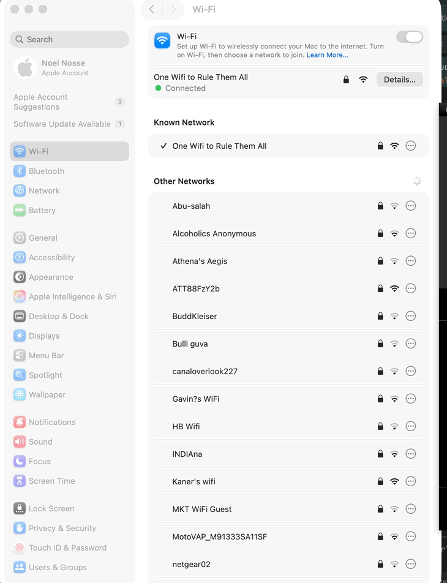

# claude-notifications

iMessage notifications for Claude Code. Send messages to your phone, get approvals via iMessage, and switch between IDE and phone approval modes dynamically.

## Install

```bash
git clone https://github.com/wwg-internal/claude-notifications.git
cd claude-notifications
./install.sh
```

Or non-interactive:
```bash
./install.sh --phone +15551234567
./install.sh --phone your.email@icloud.com
```

The installer prompts for your phone number, copies scripts, configures permissions, checks Full Disk Access, sends a test message, and offers an interactive demo.

## Prerequisites

- **macOS** (Messages.app, AppleScript, sqlite3)
- **iMessage** account signed in to Messages.app
- **Full Disk Access** for your terminal app (required for reading replies)
- **python3** (for JSON permission injection)
- **jq** (optional, only needed for `hook_notify.sh`)

## What It Does

| Script | Purpose |
|--------|---------|
| `send.sh` | Fire-and-forget iMessage (no reply expected) |
| `notify.sh` | Send message and wait for reply via iMessage |
| `read.sh` | Poll chat.db for replies (used by notify.sh) |
| `check_fda.sh` | Verify Full Disk Access is granted |
| `whitelist_commands.sh` | Inject permissions + configure RECIPIENT |
| `hook_notify.sh` | Claude Code hook wrapper (debounced) |

## Usage

After installation, Claude Code automatically uses the skill via `~/.claude/skills/imessage-notify/SKILL.md`.

### Send a status update (fire-and-forget)
```bash
~/.claude/skills/imessage-notify/send.sh "Build succeeded. All 42 tests passed."
```

### Send and wait for reply
```bash
reply=$(~/.claude/skills/imessage-notify/notify.sh "Deploy to staging? Reply YES or NO." 300 10)
```

### Multiline messages (use stdin mode)
```bash
echo "Long message here" | ~/.claude/skills/imessage-notify/send.sh -
echo "Question here" | ~/.claude/skills/imessage-notify/notify.sh - 300 10
```

### Phone mode in Claude Code

Say **"switch to iMessage"** in any Claude Code session to enable phone-only approvals. Claude will use `notify.sh` for all subsequent approvals. Reply **"switch to IDE"** on your phone to switch back.

## Per-Repo Permissions

For each new repo where you want phone mode, run:
```bash
cd /path/to/your/repo
~/.claude/skills/imessage-notify/whitelist_commands.sh
```

This injects wildcard permission entries so iMessage scripts don't require IDE approval.

## Updating

```bash
cd claude-notifications
git pull
./install.sh
```

The installer is idempotent. It detects your existing RECIPIENT and offers to keep it.

## Uninstall

```bash
./uninstall.sh
```

Removes `~/.claude/skills/imessage-notify/` and cleans global permissions.

## Multi-Session Support

Multiple Claude Code sessions can run simultaneously without cross-talk:
- Each message is tagged: `[repo-name|REQ-<unique-id>] message`
- Reply with the ID to target a specific session: `a1b2c3d4 yes`
- Plain replies go to the most recent pending request

## Troubleshooting

### Messages not arriving
1. Check Messages.app is running and signed in
2. Verify Full Disk Access: `~/.claude/skills/imessage-notify/check_fda.sh`
3. Test manually: `~/.claude/skills/imessage-notify/send.sh "test"`

### "Do you want to proceed?" keeps appearing
```bash
cd /path/to/your/repo
~/.claude/skills/imessage-notify/whitelist_commands.sh
```

### Multiline messages trigger approval prompts
Use stdin mode: `echo "msg" | send.sh -` (the glob wildcard `*` doesn't match newlines)

## Development

### Run tests
```bash
uv run pytest -m "not integration"
```

### Run integration tests (sends real iMessages)
```bash
uv run pytest -m integration
```

## Documentation

- [Quick Start](docs/quickstart.md) - 5-minute setup
- [Setup Guide](docs/setup.md) - Detailed installation
- [Demo](docs/demo.md) - Interactive walkthrough
- [Packaging Plan](docs/packaging_plan.md) - Design document